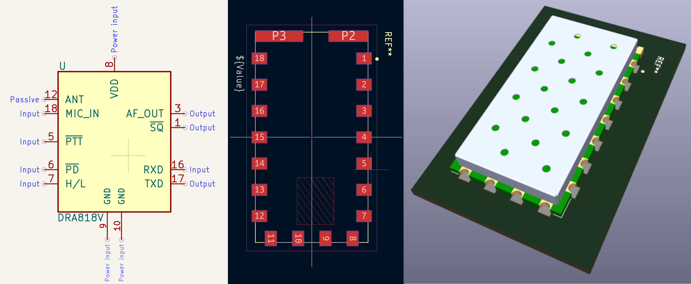

This repository contains symbols, footprints and a 3D model for VHF/UHF modules such as the Dorji [DRA818V](https://www.dorji.com/products-detail.php?ProId=55)/[DRA818U](https://www.dorji.com/products-detail.php?ProId=56) and the SA818, SA818S, SA686 and SA868S modules by [NiceRF](https://www.nicerf.com/).

